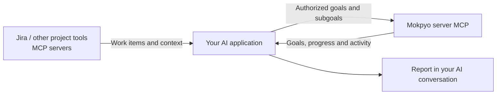
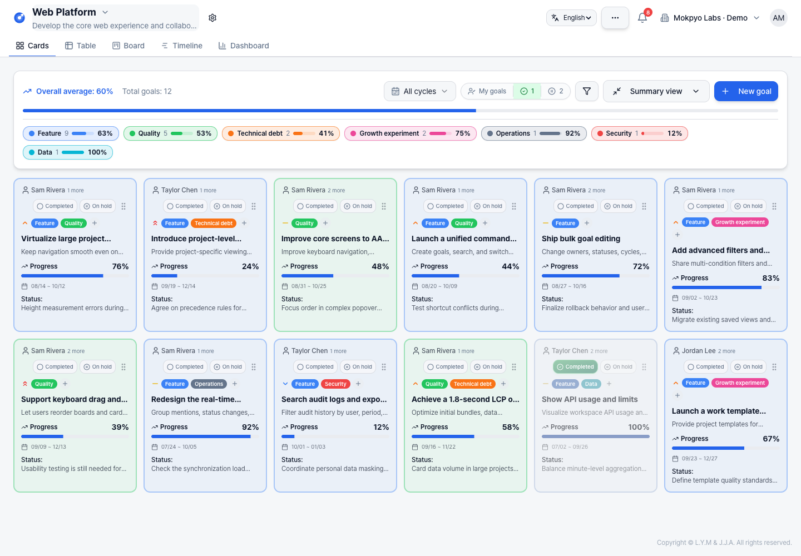

# Mokpyo

**Self-hosted, open-source goal and OKR management for teams.**

[한국어](README.ko.md) · [MIT License](LICENSE) · [ALEXSOFT](https://alexsoft.co.kr/en/) · [Architecture & development enquiries](https://alexsoft.co.kr/diagnosis/#inquiry)

[AI workflows with MCP](#use-your-ai-with-mokpyo) · [Screenshots](#screenshots) · [Quick start](#quick-start-with-docker)

Mokpyo (Korean for “goal”) brings goals, key results and project activity into card, table, board, timeline and dashboard views. Run it on your own infrastructure and adapt it to your organization. The published software has no per-seat fee or paid subscription; infrastructure and optional external services are paid by the operator. The interface supports English and Korean, with a language selector on the sign-in screen and in the app. Your choice is saved in your browser; user-authored content stays in its original language.


*A local demo workspace with fictional data. Sample goals describe illustrative work, not claims about shipped features.*

## Features

- Five views over the same goals, with project hierarchies and assignee summaries.
- Nested goals, numeric key results, aggregated progress, cycles and automatic progress-change check-in snapshots.
- Comments, @mentions, in-app notifications, attachments, email invitations and activity history.
- Custom status labels and fields, saved views and rule-based automations.
- Automation triggers for creation, status, assignee, progress and deadlines, with actions such as notifications, field updates, comments and webhooks.
- Organization membership and OWNER / ADMIN / MEMBER roles.
- Optional Azure OpenAI reports, Google login, SMTP and Amazon S3 storage.
- MCP connections for goal lookup, AI-written reports and authorized goal/subgoal imports.

The current in-app AI reports require your own Azure OpenAI configuration and send relevant goal data to that provider. Core goal management works without external integrations. The MCP server below lets an AI tool you already use read goal data and register goals without an Azure key on Mokpyo.

## Use your AI with Mokpyo

Connect the AI assistant you already use to Mokpyo's **remote MCP server**. Ask it to write a progress report from your goals and activity, or read another project tool and register meaningful goals with related subgoals. Mokpyo supplies the data and validates the writes; your AI does the analysis and writing. No AI-provider API key is required on Mokpyo for this workflow.



Your AI application connects to each service separately. Mokpyo does not need your Jira credentials. [Atlassian's official MCP server](https://atlassian.github.io/atlassian-mcp-server/) can provide Jira and Confluence context; other sources need a compatible connector in your AI application. See the [MCP architecture](https://modelcontextprotocol.io/docs/learn/architecture).

### Connect Claude

1. Run an updated Mokpyo installation and apply its migrations (`npx prisma migrate deploy`; Docker applies them at startup). Set `APP_URL` to its HTTPS application URL. The MCP endpoint defaults to the same origin at `/mcp`; set `MCP_PUBLIC_URL=https://your-host/mcp` if the API uses a different origin.
2. Open **Workspace settings → My AI connections (MCP)** and copy the server URL. Claude's remote connector runs from Anthropic's cloud, so this address must be reachable from there. A `localhost` address or a private intranet URL will not work as a Claude remote connector.
3. In Claude, open **Customize → Connectors → Add custom connector** and enter that URL. Select OAuth sign-in and **Register automatically** for the OAuth client. Mokpyo supports dynamic registration of public clients with PKCE; it does not fetch Claude's published client identity document.
4. Sign in to Mokpyo, choose the workspace, and approve **read** access (`mokpyo:read`, selected by default). If the client requests it, enable the optional **goal/subgoal import** permission (`mokpyo:write`) to allow writes. The connection covers every project in that workspace, within your membership access.
5. Enable the connector in your conversation. To import Jira work, enable its connector in the same conversation as well. You can revoke Mokpyo access at any time from workspace settings.

Claude's interface and organization controls can vary; consult its [custom connector guide](https://support.claude.com/en/articles/11175166-get-started-with-custom-connectors-using-remote-mcp). For a reverse proxy, forward `/mcp`, `/oauth/mcp/*`, and `/.well-known/*` to the API and preserve the original `Host` header. Production requires HTTPS; HTTP loopback is supported for local development. The development server proxies these routes on port 8080.

Connections use OAuth authorization codes with S256 PKCE, one-hour access tokens and rotating refresh tokens with a fixed 30-day lifetime. Credentials are hashed in the database, and every MCP request checks expiry, revocation and workspace membership. Reconnect after the refresh lifetime expires. The AI application's own fees, usage limits and data-handling terms still apply: retrieved workspace data is sent to the AI service you choose.

### Generate a progress report

Ask your AI to read the selected project's goals, subgoals, check-ins and activity for a reporting period. The report tool returns **current goal snapshots separately from changes recorded during the period**, including pagination and source links. Your AI can then explain progress, blockers, risks and next actions without confusing current progress with progress made this week.

> Write this week's progress report for the Platform project in Mokpyo. Use last Monday at 00:00 through this Monday at 00:00 in Asia/Seoul, with the end excluded. Retrieve all relevant pages and subgoal details. Separate changes this week from the current overall status. Highlight blocked goals and next actions, link to the supporting records, and say when the evidence is insufficient. Mark your recommendations as recommendations.

The report appears in your AI conversation. Scheduling it every Friday requires a scheduler in the AI application or an external automation runner; an MCP connection alone does not schedule work. The MCP server does not save generated reports or send them to colleagues.

### Import goals from Jira or another project tool

Have your AI identify outcomes worth tracking, compare them with existing Mokpyo goals, and organize the related work as subgoals. Several issues can contribute to one goal; the workflow does not require one goal per issue.

> Read the Jira APP project's onboarding work for this quarter and compare it with the existing Customer Experience goals in Mokpyo. Group related issues into goals and subgoals, preserving their source links and identifiers. Show me the proposed batch and possible duplicates first. Use only evidenced dates, metrics and confirmed member IDs. Once I authorize the batch, register it together without asking me to enter each subgoal manually.

For example, signup validation, error recovery and onboarding messages may support one goal such as “Improve signup completion.” A numeric improvement target needs evidence or a value supplied by the team.

The AI first gets the project's existing category IDs and workspace member IDs, searches existing goals, and previews the proposed batch. A successful preview does not reserve the data or guarantee the later write. Applying the batch revalidates it and saves the goals, subgoals, source mappings and audit records in one database transaction. Adding subgoals to an existing goal preserves its other subgoals and explicit status, checks the goal version, and recalculates aggregate progress with a check-in when it changes.

### Available tools and import behavior

| Tool | Purpose |
| --- | --- |
| `get_creation_context` | List workspace projects, members, categories, statuses and cycles with IDs. |
| `search_goals`, `get_goal` | Find existing goals and read details, subgoals, notes and source references. |
| `get_report_context` | Read current snapshots and activity/check-ins in an explicit reporting interval. |
| `preview_goal_import`, `preview_subgoal_append` | Validate the proposed batch and inspect source conflicts, matching titles and versions without writing. |
| `import_goals`, `append_subgoals` | Apply an authorized batch with write permission. |

- **Batch size:** Up to 10 new goals with 100 subgoals in total, or 50 additions to an existing goal. Choose an existing project and its categories; these tools do not create projects or categories.
- **Retry without duplication:** Keep the same `idempotencyKey` and payload when retrying a write. Reusing the key with different content is rejected.
- **Trace the source:** Optional source references contain `provider`, `instance`, `externalId` and `url`. A source item has one canonical goal or subgoal in a workspace; importing it again is rejected. Put an issue's reference on its subgoal rather than repeating it on the parent. Without source identifiers, matching titles are only review hints, not guaranteed deduplication.
- **Preserve existing work:** Append requires `expectedVersion` from the current goal. Concurrent edits cause a conflict instead of silently overwriting them. Source tools are never changed by Mokpyo's MCP server.
- **Explicit side effects:** Imports record audit history; appends also record a changed progress value. They do not dispatch assignment notifications, goal-created automation rules or webhooks. Continuous or bidirectional synchronization is not enabled by an import.

The server uses Streamable HTTP at `/mcp`. Other clients can use the same OAuth flow. Local verification covers the official MCP SDK client, OAuth, database transactions, concurrent retries, report reads and revocation; it does not establish a live Claude connection to your own deployment.

## Screenshots

The same goals can be explored in several views. Click an image to inspect it at full size.

| Cards | Table |
| --- | --- |
| [](assets/readme/cards.png) | [](assets/readme/table.png) |

| Board | Timeline |
| --- | --- |
| [](assets/readme/board.png) | [](assets/readme/timeline.png) |

<details>
<summary>Goal details, key results, and collaboration</summary>


</details>

## Quick start with Docker

Install Docker and Docker Compose, then:

```bash
git clone https://github.com/alexsoft-hq/Mokpyo.git
cd Mokpyo
cp .env.example .env
```

Edit `.env` before starting:

1. Replace `POSTGRES_PASSWORD` with a new random value. Hexadecimal avoids URL-encoding issues.
2. Set `JWT_SECRET` and `SESSION_SECRET` to separate values generated with `openssl rand -hex 32`.
3. For local HTTP evaluation, set `APP_URL=http://localhost:3001` and `COOKIE_SECURE=false`. For external operation, use your actual HTTPS URL and secure cookies.

```bash
docker compose --profile full up -d --build
```

Open <http://localhost:3001>. Compose sets the container's database URL and the app applies PostgreSQL migrations at startup. Database and uploaded files use separate persistent volumes. `docker compose down -v` deletes those volumes.

Without SMTP, email verification codes appear in `docker compose logs app` for local evaluation. Configure SMTP and restrict log access before accepting real users.

## Development

Use Node.js 24 and Docker. Copy `.env.example` and configure passwords and secrets. Match the password in `DATABASE_URL` to `POSTGRES_PASSWORD`, keep `?schema=dashboard`, and set `APP_URL=http://localhost:8080`.

```bash
npm ci
npm run dev:setup      # start PostgreSQL, generate Prisma client, apply migrations
npm run dev:all        # frontend :8080, API :3001
```

Optional demo seed, for a local evaluation database only:

```bash
DEMO_USER_PASSWORD='choose-a-new-demo-password' npm run db:seed:demo:en
```

The English seed creates a separate workspace with six projects, 79 goals, and fictional collaborators. Sign in as `mokpyo.demo.en.owner@example.invalid` using the password you supplied. It permits only loopback PostgreSQL connections and refuses to overwrite an existing demo workspace or user. Set `DEMO_OWNER_EMAIL` to add an existing local account as an additional owner without changing its profile. See [the seed script](prisma/seed-demo-en.ts).

## Installation and operation

See [.env.example](.env.example) for configuration and the [Prisma guide](prisma/README.md) for database changes.

- **Base setup:** Node.js 24, PostgreSQL and local attachment storage. The Docker image runs as the unprivileged `node` user.
- **Optional services:** Configure SMTP, Google OAuth, Azure OpenAI and Amazon S3 separately. Provider fees may apply.
- **Operator responsibilities:** Manage HTTPS, accounts and access, updates, monitoring, and backup and recovery for both the database and attachments.
- **Access boundaries:** Organization membership controls access. Private permissions for individual projects within an organization are not implemented.
- **Automation limits:** Automations run inside the application process, without a durable job queue or guaranteed retries.
- **Security and privacy:** See [SECURITY.md](SECURITY.md) for known behavior and vulnerability reporting. Operators must also provide privacy information appropriate to their deployment.

To create a deployment archive without Docker:

```bash
./prepare-release.sh
```

The resulting `mokpyo-production.tar.gz` contains builds, schema, migrations, dependency manifests and lockfile, and an environment example. It excludes actual `.env` files, database data and uploads. **Installing dependencies on the target server requires internet access.** Follow the README inside the archive for configuration, installation, migrations and startup. Air-gapped deployment needs separate preparation for the target environment.

## Architecture

```text
src/             React 18 · TypeScript · Vite · Tailwind · shadcn/ui
  pages/         Goal views, settings, authentication and product pages
  components/    UI and interaction components
  lib/           API client and domain calculations
server/          Express 5 · Prisma
  app.ts         App composition and shared endpoints
  routes/        Domain routers for auth, organizations, comments, cycles and automations
  middleware/    Authentication, organization context and audit logging
  services/      Automation engine and scheduler
  utils/         File storage and AI integration
prisma/          PostgreSQL schema, migrations and demo seed
docker/          Container entrypoint and database initialization
```

Mokpyo is a public example of ALEXSOFT's product engineering, from design through implementation and verification. The code covers organization-aware data access, synchronized views, rule-based automation, storage adapters and tests.

```bash
npm run ci            # typecheck, lint, tests, frontend and server builds
npm run test:watch
npm run build:root    # frontend served at /
npm run build         # frontend served at /dashboard/
npm run build:server
```

The suite includes unit and API tests that mock Prisma. Passing CI does not establish real database recovery, compatibility with every deployment environment or performance under load.

### Localization

The UI uses i18next and react-i18next. English catalogs live in [src/i18n/locales](src/i18n/locales); Korean source phrases serve as keys and Korean fallback messages. Keep variable values in interpolation parameters, translate complete messages, and preserve user-authored data. Locale switching updates labels and date formatting without remounting the app.

## Use, contribute, or work with ALEXSOFT

Report bugs and proposals through [GitHub Issues](https://github.com/alexsoft-hq/Mokpyo/issues). Read [CONTRIBUTING.md](CONTRIBUTING.md) and report vulnerabilities privately as described in [SECURITY.md](SECURITY.md). Community support is best effort with no guaranteed response or resolution time.

For architecture reviews, internal tools, deployment assistance, migrations, integrations or custom software development, [contact ALEXSOFT](https://alexsoft.co.kr/diagnosis/#inquiry) or email [contact@alexsoft.co.kr](mailto:contact@alexsoft.co.kr). Paid work has separately agreed scope, schedule, fees and support terms.

Mokpyo is available under the [MIT License](LICENSE), including commercial use, modification and redistribution with the required notices retained. Third-party components retain their own licenses; see [THIRD_PARTY_NOTICES.md](THIRD_PARTY_NOTICES.md).
