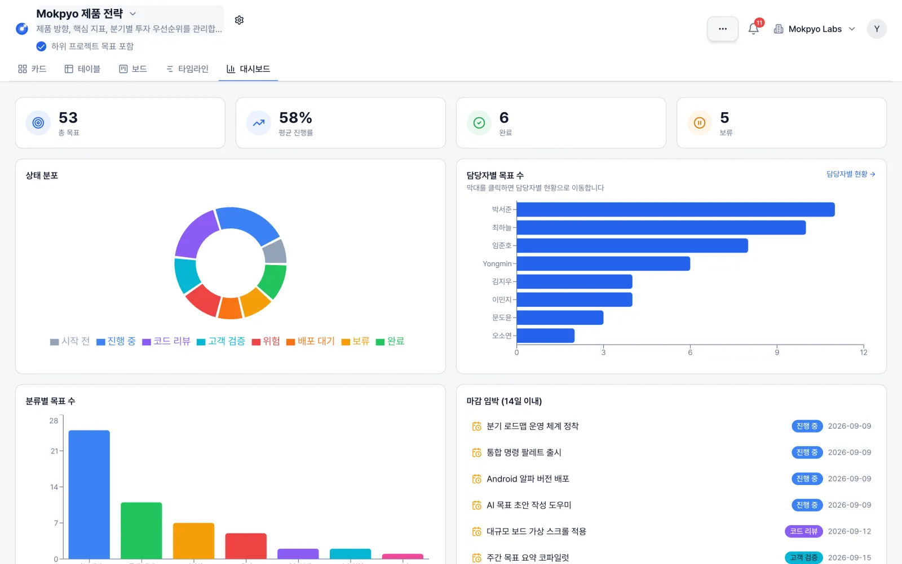

# Mokpyo · 목표

**조직의 목표를 함께 보고, 실행과 진행 상황을 관리하는 셀프호스팅 오픈소스.**

[English](README.en.md) · [MIT License](LICENSE) · [ALEXSOFT](https://alexsoft.co.kr/) · [설계·개발 상담](https://alexsoft.co.kr/diagnosis/#inquiry)

Mokpyo는 목표·OKR·프로젝트를 카드, 테이블, 보드, 타임라인, 대시보드로 관리합니다.
조직의 서버에 설치하고 업무에 맞게 수정해 사용할 수 있습니다. MIT 라이선스로 공개하며,
공개된 소프트웨어 사용에 좌석 요금이나 유료 구독은 없습니다. 서버와 외부 서비스 비용은 운영자가 부담합니다.



*데모 워크스페이스와 예시 데이터입니다.*

## 무엇을 할 수 있나요?

| 기능 | 내용 |
| --- | --- |
| 다섯 가지 뷰 | 같은 목표를 카드·테이블·칸반 보드·타임라인·집계 대시보드로 확인 |
| 목표와 OKR | 하위 목표, 수치형 Key Result, 진행률 집계, 기간별 사이클 |
| 진행 기록 | 진행률 변경 시 체크인 스냅샷 기록, 변경 이력과 담당자별 현황 |
| 협업 | 댓글, @멘션, 인앱 알림, 첨부파일, 이메일 초대 |
| 팀별 구성 | 프로젝트 계층, 상태 라벨, 커스텀 필드, 저장된 뷰 |
| 자동화 | 생성·상태·담당자·진행률·마감 트리거에 따른 알림·필드 변경·댓글·웹훅 등 |
| 워크스페이스 | 조직별 멤버십과 OWNER / ADMIN / MEMBER 역할 |
| 선택 연동 | Azure OpenAI 리포트, Google 로그인, SMTP, Amazon S3 첨부 저장 |

AI 리포트는 Azure OpenAI를 운영자가 연결해야 작동하며, 요청에 필요한 목표 데이터가 해당 서비스로 전송됩니다.
외부 연동 없이도 기본 목표 관리 기능을 사용할 수 있습니다. UI의 주 언어는 한국어입니다.

## 빠른 시작

### Docker로 실행

Docker와 Docker Compose가 필요합니다.

```bash
git clone https://github.com/alexsoft-hq/mokpyo-oss.git
cd mokpyo-oss
cp .env.example .env
```

`.env`를 편집합니다.

- `POSTGRES_PASSWORD`: 예시 비밀번호를 새로운 값으로 변경합니다. URL에 쓰기 편하도록 임의의 16진수 값을 권장합니다.
- `JWT_SECRET`, `SESSION_SECRET`: 각각 `openssl rand -hex 32`로 생성한 서로 다른 값을 넣습니다.
- 로컬 Docker 체험은 `APP_URL=http://localhost:3001`, `COOKIE_SECURE=false`로 설정합니다.
- 외부에 운영할 때는 실제 HTTPS 주소를 `APP_URL`에 지정하고 secure 쿠키를 사용합니다.

```bash
docker compose --profile full up -d --build
```

<http://localhost:3001>에서 접속합니다. 앱 시작 시 PostgreSQL 마이그레이션이 실행됩니다.
컨테이너의 `DATABASE_URL`은 Compose가 DB 서비스 주소로 설정합니다.
DB와 첨부파일은 각각 Docker 볼륨에 보관됩니다. `docker compose down -v`는 이 데이터를 삭제합니다.

로컬 체험에서 SMTP를 생략하면 회원가입 인증 코드가 `docker compose logs app`에 출력됩니다.
실제 사용자를 받는 서버에는 SMTP를 설정하고 로그 접근을 제한하세요.

### 로컬 개발

Node.js 24와 Docker가 필요합니다. `.env.example`을 복사한 뒤 위의 비밀번호·시크릿을 설정합니다.
`DATABASE_URL`의 비밀번호를 `POSTGRES_PASSWORD`와 맞추고 `?schema=dashboard`를 유지하세요.
`APP_URL`은 `http://localhost:8080`입니다.

```bash
npm ci
npm run dev:setup      # PostgreSQL 기동, Prisma 생성, 마이그레이션
npm run dev:all        # 프론트 :8080, API :3001
```

선택적으로 데모 데이터를 넣을 수 있습니다. 기존 업무 DB에는 실행하지 마세요.

```bash
DEMO_USER_PASSWORD='choose-a-new-demo-password' npm run db:seed:demo
```

데모 계정 목록은 [prisma/seed-demo.ts](prisma/seed-demo.ts)의 `memberSpecs`에 있습니다.
데모 시드는 localhost/127.0.0.1 DB만 허용합니다.

## 설치와 운영

전체 환경변수는 [.env.example](.env.example), 데이터베이스 변경 절차는 [Prisma 안내](prisma/README.md)를 참고하세요.

- **기본 구성:** Node.js 24, PostgreSQL, 로컬 첨부 저장소. Docker 이미지는 비특권 `node` 사용자로 실행됩니다.
- **선택 기능:** SMTP, Google OAuth, Azure OpenAI, Amazon S3는 운영자가 별도로 설정합니다. 각 제공자의 이용료가 발생할 수 있습니다.
- **운영 책임:** HTTPS, 계정과 접근 권한, 업데이트, 모니터링, DB와 첨부파일의 백업·복구는 운영자가 관리합니다.
- **현재 권한 범위:** 조직 멤버십이 접근 경계입니다. 조직 내부의 프로젝트별 비공개 권한은 제공하지 않습니다.
- **현재 자동화 범위:** 프로세스 내 실행 방식이며, 내구성 있는 작업 큐나 재시도 보장 서비스가 아닙니다.
- **보안과 개인정보:** 알려진 동작과 보고 방법은 [SECURITY.md](SECURITY.md)에 있습니다. 실제 운영 환경에 맞는 개인정보 안내도 운영자가 마련해야 합니다.

Docker를 쓰지 않을 때는 다음 명령으로 빌드 배포본을 만들 수 있습니다.

```bash
./prepare-release.sh
```

`mokpyo-production.tar.gz`에는 빌드 결과·스키마·마이그레이션·의존성 잠금파일·환경변수 예시가 들어갑니다.
**대상 서버에서 의존성 설치를 위한 인터넷 연결이 필요합니다.** 실제 `.env`, DB 데이터, 첨부파일은 포함하지 않습니다.
압축 안의 README에 설정·설치·마이그레이션·실행 순서가 있습니다. 폐쇄망 반입은 대상 환경에 맞는 별도 준비가 필요합니다.

## 구현 구조

```text
src/             React 18 · TypeScript · Vite · Tailwind · shadcn/ui
  pages/         목표 뷰, 설정, 인증, 제품 소개
  components/    화면과 상호작용 컴포넌트
  lib/           API 클라이언트와 도메인 계산
server/          Express 5 · Prisma
  app.ts         앱 구성과 공통 엔드포인트
  routes/        인증, 조직, 댓글, 사이클, 자동화 등 도메인 라우터
  middleware/    인증, 조직 컨텍스트, 감사 기록
  services/      자동화 엔진과 스케줄러
  utils/         파일 저장소와 AI 연동
prisma/          PostgreSQL 스키마 · 마이그레이션 · 데모 시드
docker/          컨테이너 진입점과 DB 초기화
```

ALEXSOFT가 제품 설계부터 구현·검증까지 다룬 사례로 공개합니다.
조직별 데이터 접근, 여러 뷰의 상태 동기화, 규칙 기반 자동화, 저장소 분리와 테스트를 코드에서 살펴볼 수 있습니다.

```bash
npm run ci            # 타입 검사 → lint → 테스트 → 프론트·서버 빌드
npm run test:watch
npm run build:root    # / 경로로 프론트 빌드
npm run build         # /dashboard/ 경로로 프론트 빌드
npm run build:server
```

테스트는 Prisma 클라이언트를 모킹하는 단위·API 테스트를 포함합니다.
CI 통과가 실제 DB 복구, 모든 배포 환경 또는 부하 검증을 대신하지는 않습니다.

## 사용과 기여, 그리고 필요한 도움

버그와 제안은 [GitHub Issues](https://github.com/alexsoft-hq/mokpyo-oss/issues)에 남겨주세요.
기여 절차는 [CONTRIBUTING.md](CONTRIBUTING.md), 취약점의 비공개 보고 방법은 [SECURITY.md](SECURITY.md)에 있습니다.
커뮤니티 지원은 가능한 범위에서 제공하며 응답 시간이나 해결 일정을 보장하지 않습니다.

**조직에 맞춘 설계·개발이 필요하면 [ALEXSOFT에 상담을 요청하세요](https://alexsoft.co.kr/diagnosis/#inquiry).**
Mokpyo 도입뿐 아니라 시스템 설계 검토, 사내 도구 개발, 데이터 이관, 기존 시스템 연동과 맞춤 기능 개발을 상담할 수 있습니다.
유료 업무는 범위·일정·비용·지원 조건을 별도로 합의합니다. 문의: [contact@alexsoft.co.kr](mailto:contact@alexsoft.co.kr).

[MIT 라이선스](LICENSE)는 사용·수정·재배포·상업적 활용을 허용하며, 복사본이나 상당 부분에 저작권과 라이선스 고지를 유지해야 합니다.
종속성과 포함된 제3자 코드에는 각각의 라이선스가 적용됩니다. [THIRD_PARTY_NOTICES.md](THIRD_PARTY_NOTICES.md)를 참고하세요.
