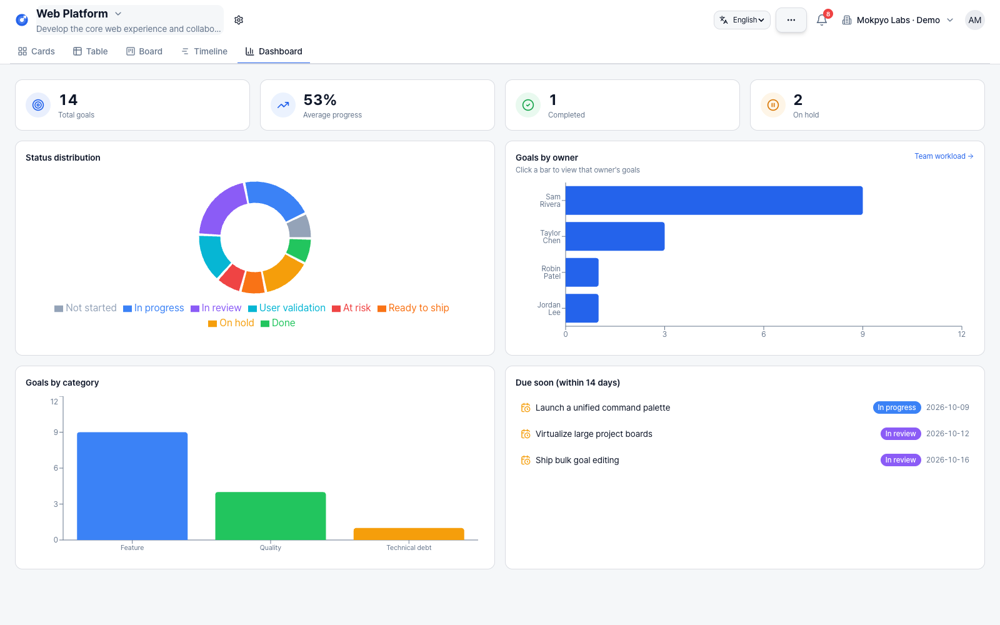
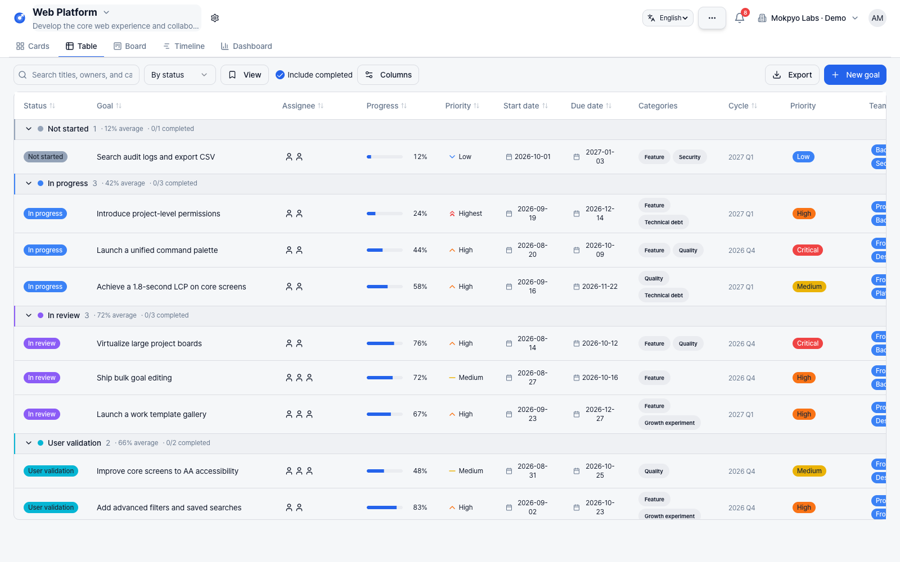
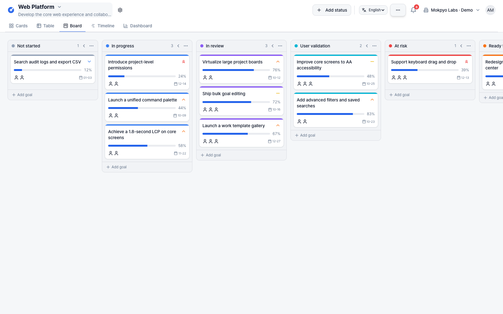
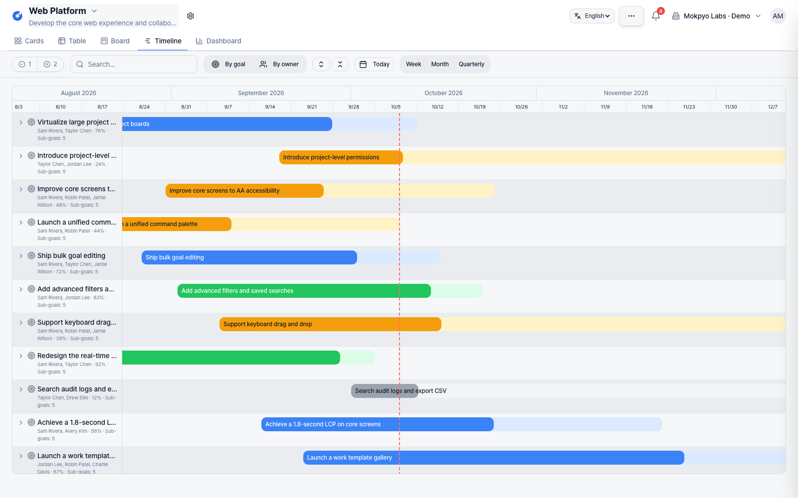
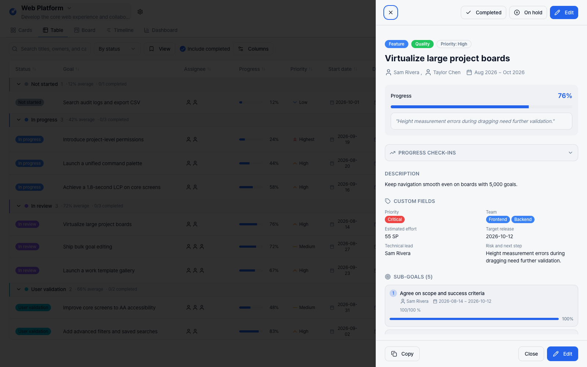

# Mokpyo · 목표

**조직의 목표를 함께 보고, 실행과 진행 상황을 관리하는 셀프호스팅 오픈소스.**

[English](../README.md) · [MIT License](../LICENSE) · [ALEXSOFT](https://alexsoft.co.kr/) · [설계·개발 상담](https://alexsoft.co.kr/diagnosis/#inquiry)

[**Claude 연결: MCP로 리포트 작성·목표 가져오기**](#mcp)

Mokpyo는 목표·OKR·프로젝트를 카드, 테이블, 보드, 타임라인, 대시보드로 관리합니다.
조직의 서버에 설치하고 업무에 맞게 수정해 사용할 수 있습니다. MIT 라이선스로 공개하며,
공개된 소프트웨어 사용에 좌석 요금이나 유료 구독은 없습니다. 서버와 외부 서비스 비용은 운영자가 부담합니다.



*가상의 데이터로 구성한 로컬 데모 워크스페이스입니다. 예시 목표는 업무 시나리오이며 제품에 구현된 기능을 뜻하지 않습니다.*

## 무엇을 할 수 있나요?

| 기능 | 내용 |
| --- | --- |
| 다섯 가지 뷰 | 같은 목표를 카드·테이블·칸반 보드·타임라인·집계 대시보드로 확인 |
| 목표와 OKR | 하위 목표, 수치형 Key Result, 진행률 집계, 기간별 사이클 |
| 진행 기록 | 진행률 변경 시 체크인 스냅샷 기록, 변경 이력과 담당자별 현황 |
| 협업 | 댓글, @멘션, 인앱 알림, 첨부파일, 이메일 초대 |
| 팀별 구성 | 프로젝트 계층, 상태 라벨, 커스텀 필드, 저장된 뷰 |
| 자동화 | 생성·상태·담당자·진행률·마감 트리거에 따른 알림·필드 변경·댓글·웹훅 등 |
| 워크스페이스 | 조직별 멤버십과 OWNER / ADMIN / MEMBER 역할 |
| 선택 연동 | Azure OpenAI 리포트, Google 로그인, SMTP, Amazon S3 첨부 저장 |
| MCP 연결 | 사용 중인 AI에서 목표 조회·리포트 작성, 목표·하위 목표 가져오기 |

앱 안의 AI 리포트는 Azure OpenAI를 운영자가 연결해야 작동하며, 요청에 필요한 목표 데이터가 해당 서비스로 전송됩니다.
외부 연동 없이도 기본 목표 관리 기능을 사용할 수 있습니다. UI는 한국어와 영어를 지원합니다. 로그인 화면과 앱의 언어 선택 메뉴에서 전환할 수 있으며, 선택은 브라우저에 저장됩니다. 사용자가 작성한 내용은 원래 언어로 유지됩니다.

<a id="mcp"></a>

## Claude와 연결해 리포트 작성·목표 가져오기

Mokpyo는 **`/mcp`에서 Streamable HTTP MCP 서버**를 제공합니다. Claude 같은 AI 앱이 목표와 진행 기록을 읽어 리포트를 작성하고, 사용자가 허용한 범위에서 목표와 하위 목표를 가져올 수 있습니다. 이 경로에서는 **Mokpyo 서버에 Azure OpenAI나 다른 AI 제공자의 API 키가 필요하지 않습니다.** 자료를 정리하고 리포트를 작성하는 모델은 사용 중인 AI 앱의 모델이며, 해당 앱의 요금제·사용량 제한과 데이터 처리 조건이 적용됩니다.

MCP 서버와 사용자 동의 화면은 구현되어 있습니다. 로컬 MCP SDK 검증과 실제 Claude 계정의 연결은 구분해야 합니다. 공개 HTTPS 운영 환경에서의 배포와 Claude 연결까지 완료되었다는 의미는 아닙니다.

### Claude에 연결하기

먼저 Mokpyo를 **Anthropic 클라우드에서 접근할 수 있는 공개 HTTPS 주소**로 운영해야 합니다. Claude의 원격 커넥터는 사용자의 기기가 아니라 Anthropic 서버에서 접속하므로, `localhost`나 외부 접근이 차단된 사내·VPN 주소를 넣으면 연결되지 않습니다. Claude Desktop의 원격 커넥터도 같습니다. 메뉴와 조직별 추가 권한은 [Claude 공식 연결 안내](https://support.claude.com/en/articles/11175166-get-started-with-custom-connectors-using-remote-mcp)를 확인하세요.

1. Mokpyo의 **워크스페이스 설정 → 내 AI 연결 (MCP)**에서 서버 주소를 복사합니다. 주소 형태는 `https://your-host/mcp`이며, `your-host`는 실제 공개 호스트로 바꿔야 합니다.
2. Claude의 **Customize → Connectors → + Add → Add custom connector**에서 이름과 복사한 주소를 입력합니다. Team·Enterprise는 조직에서 커넥터를 추가할 권한이 필요할 수 있습니다.
3. 인증 설정에서 로그인을 사용하고, **OAuth client는 `Register automatically`**를 선택합니다. Mokpyo는 공개 클라이언트의 동적 등록을 지원하며, `Use Claude’s published identity` 방식은 지원하지 않습니다. 별도의 고정 API 키를 입력하는 방식이 아닙니다.
4. Mokpyo에 로그인한 뒤 앱 이름과 반환 주소, 로그인 계정을 확인합니다. 동의 화면(`/connect/mcp`)에서 **워크스페이스 하나를 선택**합니다. 기본은 `mokpyo:read` 읽기 권한이며, 클라이언트가 쓰기를 요청한 경우에만 `mokpyo:write` 가져오기 권한을 추가로 선택할 수 있습니다.
5. **연결 허용**을 누르고 Claude로 돌아와 사용할 대화에서 커넥터를 활성화합니다. 읽기 전용 연결로도 조회·리포트 작성·가져오기 미리보기를 사용할 수 있습니다. 실제 생성은 쓰기 권한이 필요합니다.

권한은 선택한 워크스페이스의 모든 프로젝트에 적용되며 다른 워크스페이스로 자동 확장되지 않습니다. **워크스페이스 설정 → 내 AI 연결 (MCP)**에서 본인이 허용한 연결을 확인하고 해제할 수 있습니다. OAuth 2.1·PKCE S256을 사용하며, 액세스 토큰은 1시간, 갱신 토큰은 최초 발급 기준 최대 30일입니다. 갱신할 때 토큰을 교체하지만 30일 기한은 연장되지 않습니다. 화면의 액세스 토큰 만료 시각이 지났다는 사실만으로 연결이 해제된 것은 아닙니다.

**서버 운영자가 확인할 설정**

- 기존 설치를 갱신했다면 `npx prisma migrate deploy`로 추가 마이그레이션을 적용합니다. Docker 실행 경로는 앱 시작 시 마이그레이션을 적용합니다.
- `APP_URL`은 사용자가 여는 앱의 HTTPS 기본 주소입니다. MCP 주소의 기본값은 그 호스트의 `/mcp`입니다. 별도 공개 주소가 필요하면 `MCP_PUBLIC_URL`을 지정하되, 경로는 정확히 `/mcp`여야 합니다.
- 리버스 프록시는 기존 앱·API 경로에 더해 **`/mcp`, `/oauth/mcp/*`, `/.well-known/*`**를 서버로 전달해야 합니다. 앱이 `/dashboard/` 아래에 있어도 이 MCP·OAuth 경로는 호스트 루트에 있으며, 공개 `Host` 값을 유지해야 합니다.
- 연결이 되지 않으면 공개 HTTPS 접근, 위 경로의 프록시 전달, `APP_URL`과 `MCP_PUBLIC_URL`, 마이그레이션 적용 상태를 확인합니다. 로컬 HTTP 루프백은 개발용으로 허용되지만 Claude 원격 커넥터의 공개 접속 요건을 대신하지 않습니다.

설정 정의와 인증 구현은 [.env.example](../.env.example), [MCP 설정](../server/mcp/config.ts), [OAuth 구현](../server/mcp/oauth.ts)을 참고하세요.

### 시나리오 1: 목표와 실제 변경 기록으로 주간 리포트 작성

Claude에 프로젝트와 기간·시간대를 지정하면, `get_report_context`로 현재 목표와 기간 안의 활동·진행 체크인을 읽고, 필요한 하위 목표와 메모는 `get_goal`로 확인할 수 있습니다. 각 목록은 페이지로 나뉘므로 필요한 자료를 끝까지 읽어야 합니다. 보고 기간은 **시작 시각 포함, 끝 시각 제외**입니다. 한국 시간 월요일 00:00부터 다음 월요일 00:00까지처럼 요청하면 경계를 명확하게 정할 수 있습니다.

**현재 상태와 기간 중 변화는 구분해야 합니다.** 오늘 진행률이 60%라는 사실만으로 이번 주에 60%를 달성했다고 쓰면 안 됩니다. 기간 시작 시점의 수치나 체크인이 없으면 변화량을 확인할 수 없다고 명시하고, 기록에서 확인된 사실과 AI가 제안한 다음 행동을 구분합니다.

**요청 예시:**

> Mokpyo의 ‘고객 온보딩’ 프로젝트를 읽고, 한국 시간 기준 지난 월요일 00:00부터 이번 월요일 00:00 직전까지의 주간 리포트를 작성해줘. 목표·하위 목표의 현재 상태와 해당 기간의 활동·진행 체크인을 필요한 페이지까지 모두 확인해줘. 현재 진행률과 이번 주의 변화량을 분리하고, 근거가 없는 변화량은 추정하지 마. 진행 상황·위험·다음 행동 순서로 정리하고, 각 판단에 원본 목표 링크와 사용한 기록을 표시해줘. 다음 행동이 네 제안이면 그렇게 밝혀줘. 결과는 이 대화에만 작성해줘.

리포트는 **AI 대화 안에 작성**됩니다. 이 MCP 서버에는 리포트 저장·발송이나 예약 실행 도구가 없습니다. 정기 실행이 필요하면 사용 중인 AI 앱이 예약 기능을 지원하는지 확인하고 별도로 설정해야 합니다.

### 시나리오 2: Jira·다른 업무 도구에서 추적할 가치가 있는 목표 가져오기

AI 앱에 **Jira 등의 MCP와 Mokpyo MCP를 각각 연결**합니다. AI가 외부 자료를 읽고 후보를 골라 Mokpyo의 생성 도구에 전달하므로, Mokpyo 서버에 Jira 자격 증명을 보관할 필요가 없습니다. 서비스별 인증과 접근 권한은 각각 필요합니다. 이 연결 구조는 [MCP 공식 아키텍처](https://modelcontextprotocol.io/docs/learn/architecture), Jira 연결은 [Atlassian 공식 MCP 안내](https://atlassian.github.io/atlassian-mcp-server/)를 참고하세요.


외부 이슈 한 건을 무조건 목표 하나로 복제하기보다, 사용자가 정한 프로젝트·기간·선정 기준에 따라 **어떤 결과를 달성하려는 일인지** 정리하는 편이 유용합니다. 관련 이슈를 하나의 상위 목표와 하위 목표로 묶거나, 이미 있는 목표에 하위 목표만 추가할 수 있습니다. 단순 문의나 반복 운영 작업은 사용자의 기준에 따라 제외합니다.

가져올 **프로젝트와 카테고리는 Mokpyo에 먼저 있어야 합니다.** AI는 `get_creation_context`에서 실제 프로젝트·카테고리·멤버·상태·사이클 ID를 확인하고, `search_goals`와 `get_goal`로 기존 목표를 먼저 비교해야 합니다. 담당자 매핑, 일정, 진행률, 수치형 목표는 근거가 있을 때만 넣습니다. 외부 이슈의 완료 여부만 보고 성과 달성률이나 숫자 목표를 만들어서는 안 됩니다.

**요청 예시:**

> Jira의 ‘고객 포털’ 프로젝트에서 최근 4주간 변경된 이슈를 읽고, Mokpyo의 ‘고객 경험 개선’ 프로젝트에서 다음 분기까지 추적할 목표 후보를 골라줘. 고객이 체감할 결과가 분명한 개선을 우선하고, 단순 문의와 반복 운영 작업은 제외해줘. Mokpyo의 기존 목표와 카테고리·멤버를 먼저 확인하고, 중복 후보와 기존 목표에 연결할 후보를 구분해줘. 관련 이슈를 의미 있는 상위 목표와 하위 목표로 묶되 담당자·날짜·수치는 근거가 있는 것만 넣어줘. 원본 시스템·사이트·외부 식별자·링크를 유지하고, 같은 외부 이슈를 부모와 하위 목표 양쪽에 중복 연결하지 마. 새 목표 생성 또는 기존 목표에 하위 목표 추가 미리보기를 먼저 보여줘. 내가 확정해 생성하도록 허용한 배치는 그 범위 안에서 처리하고 항목마다 다시 승인받지 마. 기존 하위 목표는 보존하고 외부 도구는 수정하지 마.

미리보기는 저장하지 않습니다. 사용자가 허용한 배치를 `import_goals` 또는 `append_subgoals`로 실행한 뒤에만 생성 완료로 보고해야 합니다. 미리보기의 `canApply`가 참이어도 그 후 데이터가 달라질 수 있으므로, 쓰기 시 서버가 권한·출처 중복·버전을 다시 검증합니다. 호스트 앱 자체의 도구 승인 설정은 별도로 적용됩니다.

### 제공 도구와 가져오기 범위

| 권한 | 도구 | 용도 |
| --- | --- | --- |
| 읽기 | `get_creation_context` | 워크스페이스와 기존 프로젝트·카테고리·멤버·상태·사이클 확인 |
| 읽기 | `search_goals`, `get_goal` | 기존 목표 검색, 현재 내용과 하위 목표·메모·출처 조회 |
| 읽기 | `get_report_context` | 현재 목표와 지정 기간의 활동·체크인 조회 |
| 읽기 | `preview_goal_import`, `preview_subgoal_append` | 생성 후보와 기존 목표에 추가할 하위 목표를 저장 없이 검증 |
| 쓰기 | `import_goals` | 한 배치에 최대 목표 10개·하위 목표 합계 100개 생성 |
| 쓰기 | `append_subgoals` | 기존 목표에 최대 하위 목표 50개 추가; 기존 하위 목표 보존 |

- **출처 중복:** `sources`는 선택 사항입니다. 제공할 경우 `provider`, `instance`, `externalId`, `url`을 함께 기록합니다. 한 워크스페이스에서 같은 시스템·인스턴스·외부 ID는 하나의 목표 또는 하위 목표에만 연결할 수 있습니다. 여러 이슈를 한 목표로 묶을 수는 있지만, 같은 이슈를 부모와 하위 목표 모두에 연결할 수는 없습니다. 출처가 없는 항목은 외부 ID 기반 중복 검사를 받을 수 없으므로 기존 제목·내용도 비교해야 합니다.
- **원자적 배치와 재시도:** 생성과 출처 연결·감사 기록은 배치 단위로 함께 저장합니다. 응답을 받지 못해 재시도할 때는 **동일한 내용과 동일한 `idempotencyKey`**를 사용합니다. 같은 키로 내용을 바꾸면 거부됩니다.
- **기존 목표에 추가:** `append_subgoals`에는 `get_goal`에서 읽은 현재 버전을 `expectedVersion`으로 전달해야 합니다. 기존 하위 목표를 교체하지 않고 추가하며, 부모의 집계 진행률과 버전을 갱신합니다. 진행률이 변하면 체크인을 남기고, 생성·추가 작업은 감사 기록으로 남깁니다.
- **실행 범위:** 가져오기는 기존의 목표 생성 자동화·외부 웹훅·알림을 실행하지 않습니다. 현재 MCP 도구는 일반적인 목표 수정·삭제, 외부 원본 변경, 백그라운드 양방향 동기화를 제공하지 않습니다.

도구 정의는 [MCP 서버](../server/mcp/server.ts), 입력 한도와 필드는 [가져오기 스키마](../server/mcp/importSchemas.ts), 저장 처리는 [가져오기 구현](../server/mcp/import.ts)에서 확인할 수 있습니다.


## 화면 둘러보기

같은 목표를 여러 화면에서 확인할 수 있습니다. 이미지를 누르면 원본 크기로 볼 수 있습니다.

| 카드 | 테이블 |
| --- | --- |
| [](images/cards.png) | [](images/table.png) |

| 보드 | 타임라인 |
| --- | --- |
| [](images/board.png) | [](images/timeline.png) |

<details>
<summary>목표 상세·Key Result·협업 화면</summary>



</details>

## 빠른 시작

### Docker로 실행

Docker와 Docker Compose가 필요합니다.

```bash
git clone https://github.com/alexsoft-hq/Mokpyo.git
cd Mokpyo
cp .env.example .env
```

`.env`를 편집합니다.

- `POSTGRES_PASSWORD`: 예시 비밀번호를 새로운 값으로 변경합니다. URL에 쓰기 편하도록 임의의 16진수 값을 권장합니다.
- `JWT_SECRET`, `SESSION_SECRET`: 각각 `openssl rand -hex 32`로 생성한 서로 다른 값을 넣습니다.
- 로컬 Docker 체험은 `APP_URL=http://localhost:3001`, `COOKIE_SECURE=false`로 설정합니다.
- 외부에 운영할 때는 실제 HTTPS 주소를 `APP_URL`에 지정하고 secure 쿠키를 사용합니다.

```bash
docker compose --profile full up -d --build
```

<http://localhost:3001>에서 접속합니다. 앱 시작 시 PostgreSQL 마이그레이션이 실행됩니다.
컨테이너의 `DATABASE_URL`은 Compose가 DB 서비스 주소로 설정합니다.
DB와 첨부파일은 각각 Docker 볼륨에 보관됩니다. `docker compose down -v`는 이 데이터를 삭제합니다.

로컬 체험에서 SMTP를 생략하면 회원가입 인증 코드가 `docker compose logs app`에 출력됩니다.
실제 사용자를 받는 서버에는 SMTP를 설정하고 로그 접근을 제한하세요.

### 로컬 개발

Node.js 24와 Docker가 필요합니다. `.env.example`을 복사한 뒤 위의 비밀번호·시크릿을 설정합니다.
`DATABASE_URL`의 비밀번호를 `POSTGRES_PASSWORD`와 맞추고 `?schema=dashboard`를 유지하세요.
`APP_URL`은 `http://localhost:8080`입니다.

```bash
npm ci
npm run dev:setup      # PostgreSQL 기동, Prisma 생성, 마이그레이션
npm run dev:all        # 프론트 :8080, API :3001
```

선택적으로 데모 데이터를 넣을 수 있습니다. 기존 업무 DB에는 실행하지 마세요.

```bash
DEMO_USER_PASSWORD='choose-a-new-demo-password' npm run db:seed:demo:en
```

영어 데모 시드는 별도 워크스페이스에 프로젝트 6개, 목표 79개와 가상의 협업 데이터를 만듭니다.
`mokpyo.demo.en.owner@example.invalid`와 지정한 비밀번호로 로그인할 수 있습니다.
로컬 루프백 PostgreSQL만 허용하고, 기존 데모 워크스페이스나 계정과 충돌하면 덮어쓰지 않고 중단합니다.
`DEMO_OWNER_EMAIL`에 기존 로컬 계정 이메일을 지정하면 프로필을 변경하지 않고 추가 OWNER로 연결합니다.
자세한 내용은 [영어 데모 시드](../prisma/seed-demo-en.ts)를 참고하세요.

## 설치와 운영

전체 환경변수는 [.env.example](../.env.example), 데이터베이스 변경 절차는 [Prisma 안내](../prisma/README.md)를 참고하세요.

- **기본 구성:** Node.js 24, PostgreSQL, 로컬 첨부 저장소. Docker 이미지는 비특권 `node` 사용자로 실행됩니다.
- **선택 기능:** SMTP, Google OAuth, Azure OpenAI, Amazon S3는 운영자가 별도로 설정합니다. 각 제공자의 이용료가 발생할 수 있습니다.
- **운영 책임:** HTTPS, 계정과 접근 권한, 업데이트, 모니터링, DB와 첨부파일의 백업·복구는 운영자가 관리합니다.
- **현재 권한 범위:** 조직 멤버십이 접근 경계입니다. 조직 내부의 프로젝트별 비공개 권한은 제공하지 않습니다.
- **현재 자동화 범위:** 프로세스 내 실행 방식이며, 내구성 있는 작업 큐나 재시도 보장 서비스가 아닙니다.
- **보안과 개인정보:** 알려진 동작과 보고 방법은 [SECURITY.md](../.github/SECURITY.md)에 있습니다. 실제 운영 환경에 맞는 개인정보 안내도 운영자가 마련해야 합니다.

Docker를 쓰지 않을 때는 다음 명령으로 빌드 배포본을 만들 수 있습니다.

```bash
npm run release
```

`artifacts/release/mokpyo-production.tar.gz`에는 빌드 결과·스키마·마이그레이션·의존성 잠금파일·환경변수 예시가 들어갑니다.
**대상 서버에서 의존성 설치를 위한 인터넷 연결이 필요합니다.** 실제 `.env`, DB 데이터, 첨부파일은 포함하지 않습니다.
압축 안의 README에 설정·설치·마이그레이션·실행 순서가 있습니다. 폐쇄망 반입은 대상 환경에 맞는 별도 준비가 필요합니다.

## 구현 구조

```text
src/             React 18 · TypeScript · Vite · Tailwind · shadcn/ui
  pages/         목표 뷰, 설정, 인증, 제품 소개
  components/    화면과 상호작용 컴포넌트
  lib/           API 클라이언트와 도메인 계산
server/          Express 5 · Prisma
  app.ts         앱 구성과 공통 엔드포인트
  routes/        인증, 조직, 댓글, 사이클, 자동화 등 도메인 라우터
  middleware/    인증, 조직 컨텍스트, 감사 기록
  services/      자동화 엔진과 스케줄러
  utils/         파일 저장소와 AI 연동
prisma/          PostgreSQL 스키마 · 마이그레이션 · 데모 시드
config/          TypeScript app/node/server · Tailwind · Vitest 설정
docker/          Dockerfile · 컨테이너 진입점과 DB 초기화
scripts/         배포본 생성(prepare-release.sh)과 운영 보조 도구
docs/            한국어 README · 제3자 고지 · 문서 이미지
.github/         기여·보안 안내 · 워크플로
```

도구가 기본 경로에서 찾는 Vite·ESLint·PostCSS·루트 TypeScript 설정, shadcn 컴포넌트 설정과 Docker Compose는 저장소 루트에 둡니다.

ALEXSOFT가 제품 설계부터 구현·검증까지 다룬 사례로 공개합니다.
조직별 데이터 접근, 여러 뷰의 상태 동기화, 규칙 기반 자동화, 저장소 분리와 테스트를 코드에서 살펴볼 수 있습니다.

```bash
npm run ci            # 타입 검사 → lint → 테스트 → 프론트·서버 빌드
npm run test:watch
npm run build:root    # / 경로로 프론트 빌드
npm run build         # /dashboard/ 경로로 프론트 빌드
npm run build:server
```

테스트는 Prisma 클라이언트를 모킹하는 단위·API 테스트를 포함합니다.
CI 통과가 실제 DB 복구, 모든 배포 환경 또는 부하 검증을 대신하지는 않습니다.

### 다국어 UI

UI는 i18next와 react-i18next를 사용합니다. 영어 번역은 [src/i18n/locales](../src/i18n/locales)에 있고, 한국어 원문을 번역 키와 한국어 기본 문구로 사용합니다. 변수는 보간 인자로 분리하고 문장 단위로 번역하며, 사용자가 작성한 데이터는 번역 대상으로 삼지 않습니다. 언어를 전환하면 앱을 다시 마운트하지 않고 문구와 날짜 표시가 바뀝니다.

## 사용과 기여, 그리고 필요한 도움

버그와 제안은 [GitHub Issues](https://github.com/alexsoft-hq/Mokpyo/issues)에 남겨주세요.
기여 절차는 [CONTRIBUTING.md](../.github/CONTRIBUTING.md), 취약점의 비공개 보고 방법은 [SECURITY.md](../.github/SECURITY.md)에 있습니다.
커뮤니티 지원은 가능한 범위에서 제공하며 응답 시간이나 해결 일정을 보장하지 않습니다.

**조직에 맞춘 설계·개발이 필요하면 [ALEXSOFT에 상담을 요청하세요](https://alexsoft.co.kr/diagnosis/#inquiry).**
Mokpyo 도입뿐 아니라 시스템 설계 검토, 사내 도구 개발, 데이터 이관, 기존 시스템 연동과 맞춤 기능 개발을 상담할 수 있습니다.
유료 업무는 범위·일정·비용·지원 조건을 별도로 합의합니다. 문의: [contact@alexsoft.co.kr](mailto:contact@alexsoft.co.kr).

[MIT 라이선스](../LICENSE)는 사용·수정·재배포·상업적 활용을 허용하며, 복사본이나 상당 부분에 저작권과 라이선스 고지를 유지해야 합니다.
종속성과 포함된 제3자 코드에는 각각의 라이선스가 적용됩니다. [THIRD_PARTY_NOTICES.md](THIRD_PARTY_NOTICES.md)를 참고하세요.
